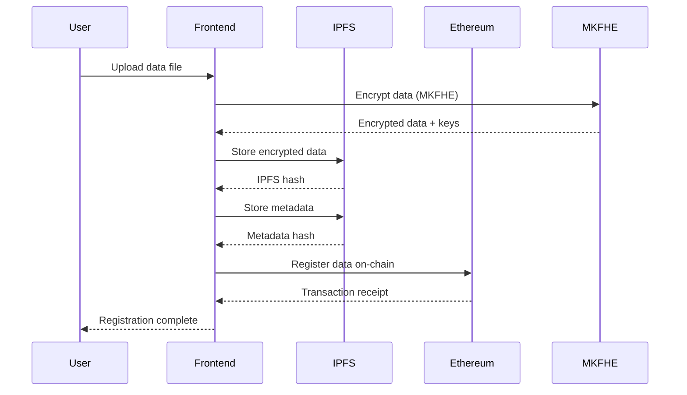
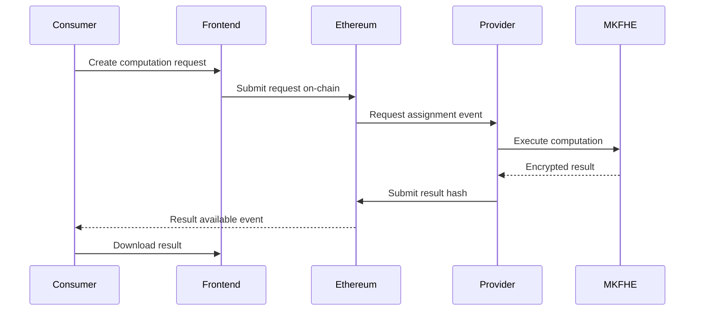

# Architecture Overview

This document provides a comprehensive overview of the SMPC Protocol system architecture, including components, data flows, and security considerations.

## 🏗️ System Architecture

```
                                    ┌─────────────────────────────────────┐
                                    │           User Interface            │
                                    │    Next.js Frontend Application     │
                                    │   (React, TypeScript, Tailwind)     │
                                    └─────────────┬───────────────────────┘
                                                  │
                              ┌───────────────────┼───────────────────┐
                              │                   │                   │
                    ┌─────────▼───────┐ ┌─────────▼─────┐   ┌─────────▼─────┐
                    │   Web3 Layer    │ │  REST API     │   │  WebSocket    │
                    │ (Wagmi, Viem)   │ │  Endpoints    │   │  Real-time    │
                    └─────────┬───────┘ └─────────┬─────┘   └─────────┬─────┘
                              │                   │                   │
              ┌───────────────┼───────────────┐   │   ┌───────────────┼─────┐
              │               │               │   │   │               │     │
    ┌─────────▼─────┐ ┌───────▼──────┐ ┌──────▼───▼───▼──┐    ┌──────▼─────┐
    │  Ethereum     │ │    IPFS      │ │     Redis      │    │   MKFHE    │
    │  Network      │ │  Storage     │ │   Database     │    │  Engine    │
    │ (Contracts)   │ │  Network     │ │   (Cache)      │    │(Microsoft  │
    │               │ │              │ │                │    │   SEAL)    │
    └───────────────┘ └──────────────┘ └────────────────┘    └────────────┘
```

## 📱 Frontend Layer

### Next.js Application
- **Framework**: Next.js 14 with App Router
- **Language**: TypeScript for type safety
- **Styling**: Tailwind CSS with dark mode support
- **State Management**: React Context API
- **Routing**: File-based routing with dynamic routes

### Component Architecture
```
src/
├── app/                    # Next.js App Router
│   ├── dashboard/         # Role-based dashboards
│   ├── auth/             # Authentication pages
│   └── layout.tsx        # Root layout
├── components/           # React components
│   ├── data-provider/    # Data provider components
│   ├── data-consumer/    # Data consumer components
│   ├── auditor/          # Auditor components
│   └── layout/           # Layout components
└── contexts/             # React contexts
    ├── ThemeContext.tsx  # Theme management
    └── RoleContext.tsx   # Role management
```

### Key Features
- **Role-Based UI**: Dynamic interface based on user role
- **Theme Support**: Dark/light mode with system preference
- **Responsive Design**: Mobile-first approach
- **Hydration Safety**: Client-side rendering for complex components

## 🔗 Web3 Integration Layer

### Wallet Connection
- **Primary**: MetaMask integration
- **Library**: Wagmi v2 with Viem
- **Features**: Auto-connection, network switching, transaction handling

### Smart Contract Interface
```typescript
interface ContractHooks {
  useDataRegistry(): {
    registerData: (params) => Promise<Result>
    getDataEntry: (hash) => Promise<DataEntry>
    updateDataStatus: (hash, status) => Promise<Result>
  }
  
  useComputingRequest(): {
    createRequest: (params) => Promise<RequestId>
    getRequest: (id) => Promise<ComputingRequest>
    updateRequestStatus: (id, status) => Promise<Result>
  }
}
```

## 📜 Smart Contract Layer

### Contract Architecture
```solidity
┌─────────────────┐    ┌──────────────────┐    ┌─────────────────┐
│   DataRegistry  │    │ ComputingRequest │    │ ApprovalManager │
│                 │    │                  │    │                 │
│ • registerData  │    │ • createRequest  │    │ • createApproval│
│ • updateStatus  │    │ • assignProvider │    │ • processRequest│
│ • getDataEntry  │    │ • completeRequest│    │ • updateStatus  │
└─────────┬───────┘    └─────────┬────────┘    └─────────┬───────┘
          │                      │                       │
          └──────────────────────┼───────────────────────┘
                                 │
                    ┌────────────▼─────────────┐
                    │     FeeManagement       │
                    │                         │
                    │ • calculateFees         │
                    │ • processPayout         │
                    │ • getUserBalance        │
                    └─────────┬───────────────┘
                              │
                    ┌─────────▼────────────────┐
                    │   PrivacyCompliance      │
                    │                          │
                    │ • acknowledgePolicy      │
                    │ • submitDataRequest      │
                    │ • auditCompliance        │
                    └──────────────────────────┘
```

### Access Control
- **Role-Based**: Data Provider, Consumer, Auditor
- **Permissions**: Granular access to contract functions
- **Ownership**: Multi-signature governance for upgrades

### Security Features
- **Reentrancy Guards**: Protection against reentrancy attacks
- **Input Validation**: Comprehensive parameter checking
- **Emergency Pausing**: Circuit breaker for critical situations
- **Upgrade Patterns**: Proxy contracts for safe upgrades

## 🗄️ Data Layer

### Data Types and Storage

#### On-Chain Data (Ethereum)
```solidity
struct DataEntry {
    bytes32 dataHash;        // IPFS content hash
    address provider;        // Data owner address
    string metadataURI;      // IPFS metadata pointer
    uint256 price;          // Price in wei
    uint8 category;         // Data category (0-5)
    string[] tags;          // Searchable tags
    bool isEncrypted;       // MKFHE encryption status
    uint256 dataSize;       // File size in bytes
    uint8 status;           // Active, suspended, etc.
    uint256 accessCount;    // Number of accesses
    uint256 createdAt;      // Creation timestamp
    uint256 updatedAt;      // Last update timestamp
}
```

#### Off-Chain Data (IPFS)
```json
{
  "title": "Healthcare Dataset Q4 2023",
  "description": "Anonymized patient records",
  "schema": {
    "type": "object",
    "properties": {
      "patientId": { "type": "string", "encrypted": true },
      "age": { "type": "integer" },
      "diagnosis": { "type": "string", "encrypted": true }
    }
  },
  "license": "CC-BY-4.0",
  "dataQuality": {
    "completeness": 0.95,
    "accuracy": 0.98,
    "consistency": 0.97
  },
  "privacy": {
    "anonymization": "k-anonymity",
    "k": 5,
    "techniques": ["generalization", "suppression"]
  }
}
```

#### Cache Layer (Redis)
```typescript
interface CacheStructure {
  // User sessions
  `session:${userId}`: UserSession
  
  // Data catalog cache
  `data:catalog:page:${page}`: DataEntry[]
  
  // Request status cache  
  `request:${requestId}:status`: RequestStatus
  
  // Analytics cache
  `analytics:dashboard:${userId}`: DashboardData
}
```

## 🔐 Cryptographic Layer

### MKFHE Implementation
```typescript
class MKFHEEngine {
  private seal: SEAL
  private context: SEALContext
  private keyGenerator: KeyGenerator
  
  async initializeSEAL(): Promise<void> {
    // Initialize Microsoft SEAL library
    // Set encryption parameters
    // Generate evaluation keys
  }
  
  async encryptData(data: ArrayBuffer): Promise<Ciphertext> {
    // Convert data to SEAL plaintext
    // Encrypt using public key
    // Return serialized ciphertext
  }
  
  async computeOnEncrypted(
    ciphertext: Ciphertext[],
    operation: ComputationScript
  ): Promise<Ciphertext> {
    // Parse computation script
    // Perform homomorphic operations
    // Return encrypted result
  }
}
```

### Privacy Features
- **Data Anonymization**: k-anonymity, differential privacy
- **Secure Computation**: Homomorphic encryption operations
- **Zero-Knowledge Proofs**: Result verification without data exposure
- **Key Management**: Secure key generation and distribution

## 🌐 API Layer

### REST API Structure
```
/api/v1/
├── auth/
│   ├── connect          # Web3 wallet connection
│   └── refresh          # Token refresh
├── data/
│   ├── upload           # Data upload to IPFS
│   ├── register         # Register data on-chain
│   └── catalog          # Browse data catalog
├── requests/
│   ├── create           # Create computation request
│   ├── status           # Check request status
│   └── results          # Retrieve results
└── analytics/
    ├── dashboard        # Dashboard metrics
    └── revenue          # Revenue tracking
```

### WebSocket Events
```typescript
interface WebSocketEvents {
  // Authentication
  'auth': { token: string }
  
  // Request updates
  'request_status': {
    requestId: number
    status: RequestStatus
    progress: number
    message: string
  }
  
  // Data notifications
  'data_available': {
    dataHash: string
    category: number
    tags: string[]
  }
  
  // Payment events
  'payment_received': {
    amount: string
    from: string
    txHash: string
  }
}
```

## 🔄 Data Flow Patterns

### Data Registration Flow


### Computation Request Flow


## 🛡️ Security Architecture

### Defense in Depth
1. **Network Security**: HTTPS/TLS, DDoS protection
2. **Application Security**: Input validation, authentication
3. **Smart Contract Security**: Formal verification, access controls
4. **Cryptographic Security**: MKFHE, zero-knowledge proofs
5. **Infrastructure Security**: Secure hosting, monitoring

### Threat Model
```
┌─────────────────┐    ┌─────────────────┐    ┌─────────────────┐
│   External      │    │   Internal      │    │   Cryptographic │
│   Threats       │    │   Threats       │    │   Threats       │
│                 │    │                 │    │                 │
│ • DDoS attacks  │    │ • Malicious     │    │ • Key compromise│
│ • Phishing     │    │   providers     │    │ • Side channels │
│ • DNS hijacking │    │ • Data leakage  │    │ • Quantum       │
└─────────────────┘    └─────────────────┘    └─────────────────┘
```

### Mitigation Strategies
- **Input Sanitization**: All user inputs validated
- **Rate Limiting**: API and transaction rate limits
- **Access Controls**: Role-based permissions
- **Monitoring**: Real-time threat detection
- **Incident Response**: Automated containment procedures

## 📊 Performance Considerations

### Scalability Patterns
- **Horizontal Scaling**: Load balancing across multiple instances
- **Caching Strategy**: Redis for frequently accessed data
- **CDN Integration**: Global content distribution
- **Database Optimization**: Indexed queries and connection pooling

### Performance Metrics
```typescript
interface PerformanceMetrics {
  frontend: {
    loadTime: number        // Page load time
    renderTime: number      // Component render time
    bundleSize: number      // JavaScript bundle size
  }
  
  backend: {
    responseTime: number    // API response time
    throughput: number      // Requests per second
    errorRate: number       // Error percentage
  }
  
  blockchain: {
    gasUsage: number        // Gas consumption
    confirmationTime: number // Transaction confirmation
    networkFees: number     // Average gas fees
  }
}
```

## 🔧 Development Architecture

### Development Workflow
```
┌─────────────┐    ┌─────────────┐    ┌─────────────┐
│    Local    │    │   Testing   │    │ Production  │
│Development  │───▶│Environment  │───▶│Deployment   │
│             │    │             │    │             │
│• Hot reload │    │• Unit tests │    │• CI/CD      │
│• Mock data  │    │• Integration│    │• Monitoring │
│• Local node │    │• E2E tests  │    │• Analytics  │
└─────────────┘    └─────────────┘    └─────────────┘
```

### Testing Strategy
- **Unit Tests**: Individual component/function testing
- **Integration Tests**: API and contract interaction testing  
- **E2E Tests**: Complete user workflow testing
- **Security Tests**: Vulnerability and penetration testing
- **Performance Tests**: Load and stress testing

## 📞 Integration Points

### External Services
- **Alchemy**: Ethereum node provider
- **IPFS**: Decentralized storage network
- **Redis**: Caching and session storage
- **Vercel**: Frontend hosting and CDN

### Third-Party Libraries
- **Microsoft SEAL**: Homomorphic encryption
- **OpenZeppelin**: Smart contract security
- **Wagmi**: Web3 React hooks
- **Next.js**: React framework

---

This architecture is designed to be secure, scalable, and maintainable while providing a seamless user experience for privacy-preserving data trading.