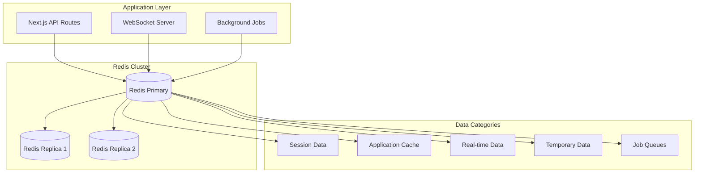

# Redis Database Schema & Integration Plan

## Overview
This document outlines the complete Redis database schema design and integration strategy for the SMPC Protocol demonstration platform. Redis serves as the primary caching layer, session store, and real-time data management system.

## Redis Architecture Design

### 1. High-Level Redis Architecture


### 2. Database Configuration
```typescript
interface RedisConfiguration {
  connection: {
    host: string;
    port: number;
    password: string;
    db: number;
    maxRetriesPerRequest: number;
    retryDelayOnFailover: number;
    lazyConnect: boolean;
  };
  cluster: {
    enableReadyCheck: boolean;
    redisOptions: RedisOptions;
    maxRetriesPerRequest: number;
  };
  performance: {
    keyPrefix: string;
    compression: 'gzip' | 'lz4';
    serialization: 'json' | 'msgpack';
    pipeline: boolean;
  };
}
```

## Data Schema Design

### 1. Session Management Schema

#### User Session Structure
```typescript
interface UserSession {
  // Key Pattern: "session:{sessionId}"
  sessionId: string;
  userId: string;
  role: UserRole;
  authMethod: 'oauth' | 'web3' | 'hybrid';
  walletAddress?: string;
  permissions: Permission[];
  metadata: SessionMetadata;
  timestamps: SessionTimestamps;
  security: SessionSecurity;
}

interface SessionMetadata {
  userAgent: string;
  ipAddress: string;
  location?: GeolocationInfo;
  deviceId: string;
  loginSource: string;
}

interface SessionTimestamps {
  createdAt: Date;
  lastActive: Date;
  expiresAt: Date;
  lastAuthRefresh: Date;
}

interface SessionSecurity {
  csrfToken: string;
  refreshToken?: string;
  mfaVerified: boolean;
  riskScore: number;
  suspicious: boolean;
}

// Redis Implementation
class SessionManager {
  private redis: RedisClient;
  private readonly SESSION_TTL = 7 * 24 * 60 * 60; // 7 days
  private readonly ACTIVE_SESSION_TTL = 30 * 60; // 30 minutes

  async createSession(session: UserSession): Promise<void> {
    const key = `session:${session.sessionId}`;
    const pipeline = this.redis.pipeline();
    
    // Store main session data
    pipeline.hset(key, {
      userId: session.userId,
      role: session.role,
      authMethod: session.authMethod,
      walletAddress: session.walletAddress || '',
      permissions: JSON.stringify(session.permissions),
      metadata: JSON.stringify(session.metadata),
      security: JSON.stringify(session.security),
      createdAt: session.timestamps.createdAt.toISOString(),
      lastActive: session.timestamps.lastActive.toISOString(),
      expiresAt: session.timestamps.expiresAt.toISOString()
    });
    
    // Set TTL
    pipeline.expire(key, this.SESSION_TTL);
    
    // Add to user's active sessions
    const userSessionsKey = `user:${session.userId}:sessions`;
    pipeline.sadd(userSessionsKey, session.sessionId);
    pipeline.expire(userSessionsKey, this.SESSION_TTL);
    
    // Add to active sessions index by role
    const roleSessionsKey = `role:${session.role}:sessions`;
    pipeline.sadd(roleSessionsKey, session.sessionId);
    pipeline.expire(roleSessionsKey, this.SESSION_TTL);
    
    await pipeline.exec();
  }

  async getSession(sessionId: string): Promise<UserSession | null> {
    const key = `session:${sessionId}`;
    const sessionData = await this.redis.hgetall(key);
    
    if (Object.keys(sessionData).length === 0) {
      return null;
    }
    
    return {
      sessionId,
      userId: sessionData.userId,
      role: sessionData.role as UserRole,
      authMethod: sessionData.authMethod as AuthMethod,
      walletAddress: sessionData.walletAddress || undefined,
      permissions: JSON.parse(sessionData.permissions),
      metadata: JSON.parse(sessionData.metadata),
      security: JSON.parse(sessionData.security),
      timestamps: {
        createdAt: new Date(sessionData.createdAt),
        lastActive: new Date(sessionData.lastActive),
        expiresAt: new Date(sessionData.expiresAt),
        lastAuthRefresh: new Date(sessionData.lastAuthRefresh || sessionData.createdAt)
      }
    };
  }

  async updateSessionActivity(sessionId: string): Promise<void> {
    const key = `session:${sessionId}`;
    const now = new Date().toISOString();
    
    await this.redis.hset(key, 'lastActive', now);
    
    // Extend TTL on activity
    await this.redis.expire(key, this.SESSION_TTL);
  }

  async revokeSession(sessionId: string): Promise<void> {
    const session = await this.getSession(sessionId);
    if (!session) return;
    
    const pipeline = this.redis.pipeline();
    
    // Remove session
    pipeline.del(`session:${sessionId}`);
    
    // Remove from user's active sessions
    pipeline.srem(`user:${session.userId}:sessions`, sessionId);
    
    // Remove from role sessions
    pipeline.srem(`role:${session.role}:sessions`, sessionId);
    
    await pipeline.exec();
  }
}
```

### 2. Application Cache Schema

#### User Profile Cache
```typescript
interface UserProfileCache {
  // Key Pattern: "user:{userId}"
  userId: string;
  profile: UserProfile;
  preferences: UserPreferences;
  statistics: UserStatistics;
  lastUpdated: Date;
}

interface UserProfile {
  email: string;
  displayName: string;
  avatar?: string;
  role: UserRole;
  walletAddresses: string[];
  verificationStatus: VerificationStatus;
  complianceStatus: ComplianceStatus;
}

interface UserStatistics {
  datasets: {
    uploaded: number;
    approved: number;
    revenue: number;
  };
  computations: {
    requested: number;
    completed: number;
    totalSpent: number;
  };
  audits: {
    performed: number;
    approved: number;
    rejected: number;
  };
}

class UserCacheManager {
  private redis: RedisClient;
  private readonly USER_CACHE_TTL = 24 * 60 * 60; // 24 hours

  async cacheUserProfile(userId: string, profile: UserProfile): Promise<void> {
    const key = `user:${userId}`;
    const cacheData = {
      profile: JSON.stringify(profile),
      lastUpdated: new Date().toISOString()
    };
    
    await this.redis.hset(key, cacheData);
    await this.redis.expire(key, this.USER_CACHE_TTL);
    
    // Index by role for efficient queries
    await this.redis.sadd(`users:role:${profile.role}`, userId);
  }

  async getCachedUserProfile(userId: string): Promise<UserProfile | null> {
    const key = `user:${userId}`;
    const data = await this.redis.hget(key, 'profile');
    
    if (!data) return null;
    
    return JSON.parse(data);
  }

  async invalidateUserCache(userId: string): Promise<void> {
    const key = `user:${userId}`;
    await this.redis.del(key);
  }
}
```

#### Data Metadata Cache
```typescript
interface DataMetadataCache {
  // Key Pattern: "data:{dataHash}"
  dataHash: string;
  metadata: DataMetadata;
  status: DataStatus;
  compliance: ComplianceInfo;
  pricing: PricingInfo;
  statistics: DataStatistics;
  lastUpdated: Date;
}

interface DataMetadata {
  title: string;
  description: string;
  category: DataCategory;
  tags: string[];
  size: number;
  format: string;
  schema: DataSchema;
  provider: string;
  encryptionInfo: EncryptionInfo;
}

interface DataStatistics {
  views: number;
  requests: number;
  downloads: number;
  revenue: number;
  lastAccessed: Date;
}

class DataCacheManager {
  private redis: RedisClient;
  private readonly DATA_CACHE_TTL = 12 * 60 * 60; // 12 hours

  async cacheDataMetadata(dataHash: string, metadata: DataMetadata): Promise<void> {
    const key = `data:${dataHash}`;
    const cacheData = {
      metadata: JSON.stringify(metadata),
      lastUpdated: new Date().toISOString()
    };
    
    const pipeline = this.redis.pipeline();
    
    // Cache metadata
    pipeline.hset(key, cacheData);
    pipeline.expire(key, this.DATA_CACHE_TTL);
    
    // Index by category
    pipeline.sadd(`data:category:${metadata.category}`, dataHash);
    
    // Index by provider
    pipeline.sadd(`data:provider:${metadata.provider}`, dataHash);
    
    // Index by tags
    metadata.tags.forEach(tag => {
      pipeline.sadd(`data:tag:${tag}`, dataHash);
    });
    
    await pipeline.exec();
  }

  async searchDataByCategory(category: DataCategory): Promise<string[]> {
    return await this.redis.smembers(`data:category:${category}`);
  }

  async searchDataByTag(tag: string): Promise<string[]> {
    return await this.redis.smembers(`data:tag:${tag}`);
  }

  async getDataStatistics(dataHash: string): Promise<DataStatistics | null> {
    const key = `data:${dataHash}:stats`;
    const stats = await this.redis.hgetall(key);
    
    if (Object.keys(stats).length === 0) return null;
    
    return {
      views: parseInt(stats.views) || 0,
      requests: parseInt(stats.requests) || 0,
      downloads: parseInt(stats.downloads) || 0,
      revenue: parseFloat(stats.revenue) || 0,
      lastAccessed: new Date(stats.lastAccessed)
    };
  }

  async incrementDataView(dataHash: string): Promise<void> {
    const key = `data:${dataHash}:stats`;
    const pipeline = this.redis.pipeline();
    
    pipeline.hincrby(key, 'views', 1);
    pipeline.hset(key, 'lastAccessed', new Date().toISOString());
    pipeline.expire(key, this.DATA_CACHE_TTL);
    
    await pipeline.exec();
  }
}
```

### 3. Real-time Data Schema

#### SMPC Computation Status
```typescript
interface ComputationStatusData {
  // Key Pattern: "computation:{requestId}:status"
  requestId: string;
  status: ComputationStatus;
  progress: ComputationProgress;
  participants: ParticipantInfo[];
  results: ComputationResults;
  events: ComputationEvent[];
  timestamps: ComputationTimestamps;
}

interface ComputationProgress {
  stage: ComputationStage;
  percentage: number;
  currentOperation: string;
  estimatedTimeRemaining: number;
  throughput: number;
}

interface ParticipantInfo {
  nodeId: string;
  status: ParticipantStatus;
  contribution: number;
  lastHeartbeat: Date;
}

class ComputationStatusManager {
  private redis: RedisClient;
  private readonly COMPUTATION_TTL = 30 * 24 * 60 * 60; // 30 days

  async updateComputationStatus(
    requestId: string, 
    status: ComputationStatus
  ): Promise<void> {
    const key = `computation:${requestId}:status`;
    const statusData = {
      status: status.status,
      progress: JSON.stringify(status.progress),
      participants: JSON.stringify(status.participants),
      updatedAt: new Date().toISOString()
    };
    
    const pipeline = this.redis.pipeline();
    
    // Update status
    pipeline.hset(key, statusData);
    pipeline.expire(key, this.COMPUTATION_TTL);
    
    // Add to timeline
    const timelineKey = `computation:${requestId}:timeline`;
    const event = {
      timestamp: new Date().toISOString(),
      status: status.status,
      progress: status.progress.percentage,
      operation: status.progress.currentOperation
    };
    pipeline.lpush(timelineKey, JSON.stringify(event));
    pipeline.ltrim(timelineKey, 0, 100); // Keep last 100 events
    pipeline.expire(timelineKey, this.COMPUTATION_TTL);
    
    // Publish real-time update
    const updateChannel = `computation:${requestId}:updates`;
    pipeline.publish(updateChannel, JSON.stringify(status));
    
    await pipeline.exec();
  }

  async getComputationStatus(requestId: string): Promise<ComputationStatus | null> {
    const key = `computation:${requestId}:status`;
    const data = await this.redis.hgetall(key);
    
    if (Object.keys(data).length === 0) return null;
    
    return {
      requestId,
      status: data.status as ComputationStageType,
      progress: JSON.parse(data.progress),
      participants: JSON.parse(data.participants),
      updatedAt: new Date(data.updatedAt)
    };
  }

  async subscribeToComputationUpdates(
    requestId: string,
    callback: (status: ComputationStatus) => void
  ): Promise<void> {
    const channel = `computation:${requestId}:updates`;
    await this.redis.subscribe(channel);
    
    this.redis.on('message', (receivedChannel, message) => {
      if (receivedChannel === channel) {
        const status = JSON.parse(message);
        callback(status);
      }
    });
  }

  async getComputationTimeline(requestId: string): Promise<ComputationEvent[]> {
    const key = `computation:${requestId}:timeline`;
    const events = await this.redis.lrange(key, 0, -1);
    
    return events.map(event => JSON.parse(event));
  }
}
```

#### Blockchain Event Cache
```typescript
interface BlockchainEventData {
  // Key Pattern: "blockchain:event:{txHash}:{logIndex}"
  transactionHash: string;
  logIndex: number;
  contractAddress: string;
  eventName: string;
  blockNumber: number;
  blockHash: string;
  timestamp: Date;
  args: any;
  decoded: DecodedEventData;
}

class BlockchainEventManager {
  private redis: RedisClient;
  private readonly EVENT_TTL = 90 * 24 * 60 * 60; // 90 days

  async cacheBlockchainEvent(event: BlockchainEventData): Promise<void> {
    const key = `blockchain:event:${event.transactionHash}:${event.logIndex}`;
    const eventData = {
      contractAddress: event.contractAddress,
      eventName: event.eventName,
      blockNumber: event.blockNumber.toString(),
      blockHash: event.blockHash,
      timestamp: event.timestamp.toISOString(),
      args: JSON.stringify(event.args),
      decoded: JSON.stringify(event.decoded)
    };
    
    const pipeline = this.redis.pipeline();
    
    // Cache event
    pipeline.hset(key, eventData);
    pipeline.expire(key, this.EVENT_TTL);
    
    // Index by contract and event type
    const contractEventKey = `blockchain:${event.contractAddress}:${event.eventName}`;
    pipeline.zadd(contractEventKey, event.blockNumber, key);
    pipeline.expire(contractEventKey, this.EVENT_TTL);
    
    // Index by block number
    const blockEventsKey = `blockchain:block:${event.blockNumber}:events`;
    pipeline.sadd(blockEventsKey, key);
    pipeline.expire(blockEventsKey, this.EVENT_TTL);
    
    await pipeline.exec();
  }

  async getEventsByContract(
    contractAddress: string,
    eventName: string,
    fromBlock?: number,
    toBlock?: number
  ): Promise<BlockchainEventData[]> {
    const key = `blockchain:${contractAddress}:${eventName}`;
    const min = fromBlock ? fromBlock : '-inf';
    const max = toBlock ? toBlock : '+inf';
    
    const eventKeys = await this.redis.zrangebyscore(key, min, max);
    
    if (eventKeys.length === 0) return [];
    
    const pipeline = this.redis.pipeline();
    eventKeys.forEach(eventKey => {
      pipeline.hgetall(eventKey);
    });
    
    const results = await pipeline.exec();
    
    return results.map((result, index) => {
      const [err, data] = result;
      if (err || !data) return null;
      
      return {
        transactionHash: eventKeys[index].split(':')[2],
        logIndex: parseInt(eventKeys[index].split(':')[3]),
        contractAddress: data.contractAddress,
        eventName: data.eventName,
        blockNumber: parseInt(data.blockNumber),
        blockHash: data.blockHash,
        timestamp: new Date(data.timestamp),
        args: JSON.parse(data.args),
        decoded: JSON.parse(data.decoded)
      };
    }).filter(Boolean);
  }
}
```

### 4. Temporary Data Storage

#### Encrypted Data Staging
```typescript
interface TemporaryDataStorage {
  // Key Pattern: "temp:{dataId}"
  dataId: string;
  encryptedData: Buffer;
  metadata: TemporaryDataMetadata;
  expiresAt: Date;
}

interface TemporaryDataMetadata {
  originalSize: number;
  encryptionAlgorithm: string;
  checksum: string;
  uploadedBy: string;
  purpose: 'upload' | 'computation' | 'transfer';
}

class TemporaryDataManager {
  private redis: RedisClient;
  private readonly DEFAULT_TTL = 3600; // 1 hour
  private readonly MAX_TTL = 24 * 60 * 60; // 24 hours

  async storeTemporaryData(
    dataId: string,
    encryptedData: Buffer,
    metadata: TemporaryDataMetadata,
    ttl: number = this.DEFAULT_TTL
  ): Promise<void> {
    const key = `temp:${dataId}`;
    const metadataKey = `temp:${dataId}:meta`;
    
    // Ensure TTL doesn't exceed maximum
    const safeTtl = Math.min(ttl, this.MAX_TTL);
    
    const pipeline = this.redis.pipeline();
    
    // Store encrypted data
    pipeline.set(key, encryptedData);
    pipeline.expire(key, safeTtl);
    
    // Store metadata
    pipeline.hset(metadataKey, {
      originalSize: metadata.originalSize.toString(),
      encryptionAlgorithm: metadata.encryptionAlgorithm,
      checksum: metadata.checksum,
      uploadedBy: metadata.uploadedBy,
      purpose: metadata.purpose,
      storedAt: new Date().toISOString(),
      expiresAt: new Date(Date.now() + safeTtl * 1000).toISOString()
    });
    pipeline.expire(metadataKey, safeTtl);
    
    // Add to user's temporary data index
    const userTempKey = `user:${metadata.uploadedBy}:temp`;
    pipeline.sadd(userTempKey, dataId);
    pipeline.expire(userTempKey, safeTtl);
    
    await pipeline.exec();
  }

  async getTemporaryData(dataId: string): Promise<{
    data: Buffer;
    metadata: TemporaryDataMetadata;
  } | null> {
    const key = `temp:${dataId}`;
    const metadataKey = `temp:${dataId}:meta`;
    
    const [data, metadata] = await Promise.all([
      this.redis.getBuffer(key),
      this.redis.hgetall(metadataKey)
    ]);
    
    if (!data || Object.keys(metadata).length === 0) {
      return null;
    }
    
    return {
      data,
      metadata: {
        originalSize: parseInt(metadata.originalSize),
        encryptionAlgorithm: metadata.encryptionAlgorithm,
        checksum: metadata.checksum,
        uploadedBy: metadata.uploadedBy,
        purpose: metadata.purpose as any
      }
    };
  }

  async deleteTemporaryData(dataId: string): Promise<void> {
    const metadataKey = `temp:${dataId}:meta`;
    const metadata = await this.redis.hgetall(metadataKey);
    
    if (Object.keys(metadata).length === 0) return;
    
    const pipeline = this.redis.pipeline();
    
    // Delete data and metadata
    pipeline.del(`temp:${dataId}`);
    pipeline.del(metadataKey);
    
    // Remove from user's temporary data index
    if (metadata.uploadedBy) {
      pipeline.srem(`user:${metadata.uploadedBy}:temp`, dataId);
    }
    
    await pipeline.exec();
  }

  async cleanupExpiredData(): Promise<number> {
    const pattern = 'temp:*:meta';
    const keys = await this.redis.keys(pattern);
    let cleanupCount = 0;
    
    for (const metadataKey of keys) {
      const metadata = await this.redis.hgetall(metadataKey);
      
      if (Object.keys(metadata).length === 0) continue;
      
      const expiresAt = new Date(metadata.expiresAt);
      const now = new Date();
      
      if (now > expiresAt) {
        const dataId = metadataKey.replace('temp:', '').replace(':meta', '');
        await this.deleteTemporaryData(dataId);
        cleanupCount++;
      }
    }
    
    return cleanupCount;
  }
}
```

### 5. Job Queue System

#### Background Job Management
```typescript
interface JobQueueData {
  // Key Patterns: 
  // "queue:{queueName}" (list)
  // "job:{jobId}" (hash)
  // "jobs:active" (set)
  // "jobs:completed" (sorted set)
  // "jobs:failed" (sorted set)
}

interface Job {
  id: string;
  type: JobType;
  payload: any;
  priority: number;
  attempts: number;
  maxAttempts: number;
  status: JobStatus;
  timestamps: JobTimestamps;
  result?: any;
  error?: string;
}

enum JobType {
  DATA_ENCRYPTION = 'data-encryption',
  SMPC_COMPUTATION = 'smpc-computation',
  BLOCKCHAIN_TRANSACTION = 'blockchain-transaction',
  AUDIT_VERIFICATION = 'audit-verification',
  NOTIFICATION_SEND = 'notification-send',
  CLEANUP_TEMP_DATA = 'cleanup-temp-data'
}

class JobQueueManager {
  private redis: RedisClient;
  private readonly JOB_TTL = 7 * 24 * 60 * 60; // 7 days
  private readonly RESULT_TTL = 24 * 60 * 60; // 24 hours

  async enqueueJob(job: Job): Promise<void> {
    const jobKey = `job:${job.id}`;
    const queueKey = `queue:${this.getQueueName(job.type)}`;
    
    const jobData = {
      id: job.id,
      type: job.type,
      payload: JSON.stringify(job.payload),
      priority: job.priority.toString(),
      attempts: '0',
      maxAttempts: job.maxAttempts.toString(),
      status: 'pending',
      createdAt: new Date().toISOString(),
      updatedAt: new Date().toISOString()
    };
    
    const pipeline = this.redis.pipeline();
    
    // Store job data
    pipeline.hset(jobKey, jobData);
    pipeline.expire(jobKey, this.JOB_TTL);
    
    // Add to queue with priority
    const score = Date.now() + (1000 - job.priority); // Higher priority = lower score
    pipeline.zadd(queueKey, score, job.id);
    
    // Add to pending jobs set
    pipeline.sadd('jobs:pending', job.id);
    
    await pipeline.exec();
  }

  async dequeueJob(queueName: string): Promise<Job | null> {
    const queueKey = `queue:${queueName}`;
    
    // Get highest priority job
    const jobIds = await this.redis.zrange(queueKey, 0, 0);
    if (jobIds.length === 0) return null;
    
    const jobId = jobIds[0];
    const jobKey = `job:${jobId}`;
    
    // Move job to active
    const pipeline = this.redis.pipeline();
    pipeline.zrem(queueKey, jobId);
    pipeline.srem('jobs:pending', jobId);
    pipeline.sadd('jobs:active', jobId);
    pipeline.hset(jobKey, {
      status: 'active',
      startedAt: new Date().toISOString(),
      updatedAt: new Date().toISOString()
    });
    
    await pipeline.exec();
    
    // Get job data
    const jobData = await this.redis.hgetall(jobKey);
    
    return {
      id: jobData.id,
      type: jobData.type as JobType,
      payload: JSON.parse(jobData.payload),
      priority: parseInt(jobData.priority),
      attempts: parseInt(jobData.attempts),
      maxAttempts: parseInt(jobData.maxAttempts),
      status: jobData.status as JobStatus,
      timestamps: {
        createdAt: new Date(jobData.createdAt),
        startedAt: new Date(jobData.startedAt),
        updatedAt: new Date(jobData.updatedAt)
      }
    };
  }

  async completeJob(jobId: string, result: any): Promise<void> {
    const jobKey = `job:${jobId}`;
    const now = new Date().toISOString();
    
    const pipeline = this.redis.pipeline();
    
    // Update job status
    pipeline.hset(jobKey, {
      status: 'completed',
      result: JSON.stringify(result),
      completedAt: now,
      updatedAt: now
    });
    
    // Move to completed jobs
    pipeline.srem('jobs:active', jobId);
    pipeline.zadd('jobs:completed', Date.now(), jobId);
    
    // Set shorter TTL for completed jobs
    pipeline.expire(jobKey, this.RESULT_TTL);
    
    await pipeline.exec();
  }

  async failJob(jobId: string, error: string): Promise<boolean> {
    const jobKey = `job:${jobId}`;
    const jobData = await this.redis.hgetall(jobKey);
    
    if (!jobData) return false;
    
    const attempts = parseInt(jobData.attempts) + 1;
    const maxAttempts = parseInt(jobData.maxAttempts);
    const now = new Date().toISOString();
    
    const pipeline = this.redis.pipeline();
    
    if (attempts >= maxAttempts) {
      // Job permanently failed
      pipeline.hset(jobKey, {
        status: 'failed',
        attempts: attempts.toString(),
        error: error,
        failedAt: now,
        updatedAt: now
      });
      
      pipeline.srem('jobs:active', jobId);
      pipeline.zadd('jobs:failed', Date.now(), jobId);
    } else {
      // Retry job
      pipeline.hset(jobKey, {
        status: 'pending',
        attempts: attempts.toString(),
        error: error,
        updatedAt: now
      });
      
      pipeline.srem('jobs:active', jobId);
      pipeline.sadd('jobs:pending', jobId);
      
      // Re-queue with delay
      const queueKey = `queue:${this.getQueueName(jobData.type as JobType)}`;
      const delay = Math.pow(2, attempts) * 1000; // Exponential backoff
      pipeline.zadd(queueKey, Date.now() + delay, jobId);
    }
    
    await pipeline.exec();
    
    return attempts >= maxAttempts;
  }

  private getQueueName(jobType: JobType): string {
    switch (jobType) {
      case JobType.DATA_ENCRYPTION:
        return 'encryption';
      case JobType.SMPC_COMPUTATION:
        return 'computation';
      case JobType.BLOCKCHAIN_TRANSACTION:
        return 'blockchain';
      case JobType.AUDIT_VERIFICATION:
        return 'audit';
      case JobType.NOTIFICATION_SEND:
        return 'notifications';
      case JobType.CLEANUP_TEMP_DATA:
        return 'cleanup';
      default:
        return 'default';
    }
  }
}
```

## Redis Configuration & Optimization

### 1. Production Configuration
```typescript
class RedisManager {
  private primaryClient: RedisClient;
  private replicaClients: RedisClient[];
  private config: RedisConfiguration;

  constructor(config: RedisConfiguration) {
    this.config = config;
    this.initializeClients();
    this.setupHealthChecks();
    this.setupPerformanceMonitoring();
  }

  private initializeClients(): void {
    // Primary client for writes
    this.primaryClient = new Redis({
      host: this.config.primary.host,
      port: this.config.primary.port,
      password: this.config.primary.password,
      db: 0,
      maxRetriesPerRequest: 3,
      retryDelayOnFailover: 100,
      lazyConnect: true,
      compression: 'gzip',
      keyPrefix: 'smpc:',
    });

    // Replica clients for reads
    this.replicaClients = this.config.replicas.map(replica => 
      new Redis({
        host: replica.host,
        port: replica.port,
        password: replica.password,
        db: 0,
        maxRetriesPerRequest: 3,
        retryDelayOnFailover: 100,
        lazyConnect: true,
        keyPrefix: 'smpc:',
      })
    );
  }

  // Read from replica with failover to primary
  async read(key: string): Promise<string | null> {
    for (const replica of this.replicaClients) {
      try {
        return await replica.get(key);
      } catch (error) {
        console.warn('Replica read failed, trying next replica');
      }
    }
    
    // Fallback to primary
    return await this.primaryClient.get(key);
  }

  // Always write to primary
  async write(key: string, value: string, ttl?: number): Promise<void> {
    if (ttl) {
      await this.primaryClient.setex(key, ttl, value);
    } else {
      await this.primaryClient.set(key, value);
    }
  }

  // Health check
  async healthCheck(): Promise<RedisHealthStatus> {
    const checks = await Promise.allSettled([
      this.primaryClient.ping(),
      ...this.replicaClients.map(client => client.ping())
    ]);

    return {
      primary: checks[0].status === 'fulfilled',
      replicas: checks.slice(1).map(check => check.status === 'fulfilled'),
      timestamp: new Date()
    };
  }
}
```

### 2. Memory Optimization
```typescript
interface RedisMemoryConfig {
  maxMemory: string;
  maxMemoryPolicy: 'allkeys-lru' | 'volatile-lru' | 'allkeys-lfu' | 'volatile-lfu';
  compression: boolean;
  keyExpiration: {
    sessions: number;
    cache: number;
    temporary: number;
    events: number;
  };
}

class MemoryOptimizationManager {
  private redis: RedisClient;

  async optimizeMemoryUsage(): Promise<void> {
    // Set memory policies
    await this.redis.config('SET', 'maxmemory-policy', 'allkeys-lru');
    
    // Enable compression
    await this.redis.config('SET', 'hash-max-ziplist-entries', '512');
    await this.redis.config('SET', 'hash-max-ziplist-value', '64');
    
    // Optimize key expiration
    await this.redis.config('SET', 'active-expire-keys-per-second', '20');
  }

  async getMemoryStats(): Promise<RedisMemoryStats> {
    const info = await this.redis.info('memory');
    const stats = this.parseMemoryInfo(info);
    
    return {
      usedMemory: stats.used_memory,
      maxMemory: stats.maxmemory,
      usedMemoryRss: stats.used_memory_rss,
      usedMemoryPeak: stats.used_memory_peak,
      memoryFragmentationRatio: stats.mem_fragmentation_ratio,
      keyspaceHits: stats.keyspace_hits,
      keyspaceMisses: stats.keyspace_misses,
      hitRate: stats.keyspace_hits / (stats.keyspace_hits + stats.keyspace_misses)
    };
  }
}
```

### 3. Performance Monitoring
```typescript
class RedisPerformanceMonitor {
  private redis: RedisClient;
  private metrics: PerformanceMetrics;

  async collectMetrics(): Promise<PerformanceMetrics> {
    const info = await this.redis.info('stats');
    const slowlog = await this.redis.slowlog('get', 100);
    
    return {
      operations: {
        totalConnections: this.parseStatInfo(info, 'total_connections_received'),
        totalCommands: this.parseStatInfo(info, 'total_commands_processed'),
        instantaneousOps: this.parseStatInfo(info, 'instantaneous_ops_per_sec'),
      },
      performance: {
        hitRate: this.calculateHitRate(info),
        avgResponseTime: this.calculateAvgResponseTime(slowlog),
        slowQueries: slowlog.length,
      },
      connections: {
        connected: this.parseStatInfo(info, 'connected_clients'),
        blocked: this.parseStatInfo(info, 'blocked_clients'),
        rejected: this.parseStatInfo(info, 'rejected_connections'),
      },
      timestamp: new Date()
    };
  }

  async alertOnPerformanceIssues(metrics: PerformanceMetrics): Promise<void> {
    // Alert on low hit rate
    if (metrics.performance.hitRate < 0.8) {
      await this.sendAlert('Low Redis hit rate', metrics.performance.hitRate);
    }
    
    // Alert on high response time
    if (metrics.performance.avgResponseTime > 100) {
      await this.sendAlert('High Redis response time', metrics.performance.avgResponseTime);
    }
    
    // Alert on too many slow queries
    if (metrics.performance.slowQueries > 10) {
      await this.sendAlert('Too many slow Redis queries', metrics.performance.slowQueries);
    }
  }
}
```

## Integration Implementation

### 1. Service Integration Layer
```typescript
class RedisIntegrationService {
  private sessionManager: SessionManager;
  private userCacheManager: UserCacheManager;
  private dataCacheManager: DataCacheManager;
  private computationStatusManager: ComputationStatusManager;
  private blockchainEventManager: BlockchainEventManager;
  private temporaryDataManager: TemporaryDataManager;
  private jobQueueManager: JobQueueManager;

  constructor(redisConfig: RedisConfiguration) {
    const redis = new RedisManager(redisConfig);
    
    this.sessionManager = new SessionManager(redis.primaryClient);
    this.userCacheManager = new UserCacheManager(redis.primaryClient);
    this.dataCacheManager = new DataCacheManager(redis.primaryClient);
    this.computationStatusManager = new ComputationStatusManager(redis.primaryClient);
    this.blockchainEventManager = new BlockchainEventManager(redis.primaryClient);
    this.temporaryDataManager = new TemporaryDataManager(redis.primaryClient);
    this.jobQueueManager = new JobQueueManager(redis.primaryClient);
  }

  // Unified interface for all Redis operations
  async handleUserLogin(user: User): Promise<UserSession> {
    const session = await this.sessionManager.createSession({
      sessionId: generateSessionId(),
      userId: user.id,
      role: user.role,
      authMethod: user.authMethod,
      // ... other session data
    });

    await this.userCacheManager.cacheUserProfile(user.id, user.profile);
    
    return session;
  }

  async handleDataUpload(dataHash: string, metadata: DataMetadata): Promise<void> {
    await this.dataCacheManager.cacheDataMetadata(dataHash, metadata);
    
    // Queue encryption job
    await this.jobQueueManager.enqueueJob({
      id: generateJobId(),
      type: JobType.DATA_ENCRYPTION,
      payload: { dataHash, metadata },
      priority: 5,
      attempts: 0,
      maxAttempts: 3,
      status: 'pending',
      timestamps: {
        createdAt: new Date(),
        updatedAt: new Date()
      }
    });
  }

  async handleComputationRequest(request: ComputationRequest): Promise<void> {
    // Initialize computation status tracking
    await this.computationStatusManager.updateComputationStatus(
      request.id,
      {
        requestId: request.id,
        status: 'pending',
        progress: { stage: 'initialization', percentage: 0, currentOperation: 'validating request' },
        participants: [],
        updatedAt: new Date()
      }
    );

    // Queue computation job
    await this.jobQueueManager.enqueueJob({
      id: generateJobId(),
      type: JobType.SMPC_COMPUTATION,
      payload: request,
      priority: 10,
      attempts: 0,
      maxAttempts: 1,
      status: 'pending',
      timestamps: {
        createdAt: new Date(),
        updatedAt: new Date()
      }
    });
  }
}
```

### 2. Next.js API Integration
```typescript
// /src/lib/redis.ts
import { RedisIntegrationService } from './redis-integration';

export const redis = new RedisIntegrationService({
  primary: {
    host: process.env.REDIS_HOST || 'localhost',
    port: parseInt(process.env.REDIS_PORT) || 6379,
    password: process.env.REDIS_PASSWORD,
  },
  replicas: [
    {
      host: process.env.REDIS_REPLICA1_HOST || 'localhost',
      port: parseInt(process.env.REDIS_REPLICA1_PORT) || 6380,
    },
    {
      host: process.env.REDIS_REPLICA2_HOST || 'localhost',
      port: parseInt(process.env.REDIS_REPLICA2_PORT) || 6381,
    }
  ]
});

// Usage in API routes
// /src/app/api/auth/[...nextauth]/route.ts
export async function POST(request: Request) {
  const session = await redis.handleUserLogin(user);
  return NextResponse.json({ session });
}

// /src/app/api/data/upload/route.ts
export async function POST(request: Request) {
  const { dataHash, metadata } = await request.json();
  await redis.handleDataUpload(dataHash, metadata);
  return NextResponse.json({ success: true });
}
```

## Deployment & Monitoring

### 1. Docker Configuration
```yaml
# docker-compose.yml
version: '3.8'
services:
  redis-primary:
    image: redis:7-alpine
    command: redis-server --maxmemory 2gb --maxmemory-policy allkeys-lru
    ports:
      - "6379:6379"
    volumes:
      - redis_primary_data:/data
    environment:
      - REDIS_PASSWORD=${REDIS_PASSWORD}

  redis-replica-1:
    image: redis:7-alpine
    command: redis-server --replicaof redis-primary 6379 --maxmemory 1gb
    depends_on:
      - redis-primary
    ports:
      - "6380:6379"
    volumes:
      - redis_replica1_data:/data

  redis-replica-2:
    image: redis:7-alpine
    command: redis-server --replicaof redis-primary 6379 --maxmemory 1gb
    depends_on:
      - redis-primary
    ports:
      - "6381:6379"
    volumes:
      - redis_replica2_data:/data

volumes:
  redis_primary_data:
  redis_replica1_data:
  redis_replica2_data:
```

### 2. Monitoring Dashboard
```typescript
interface RedisDashboard {
  metrics: RedisMetrics;
  alerts: RedisAlert[];
  performance: PerformanceCharts;
  capacity: CapacityPlanning;
}

class RedisDashboardService {
  async generateDashboard(): Promise<RedisDashboard> {
    const metrics = await this.collectCurrentMetrics();
    const alerts = await this.checkAlerts();
    const performance = await this.generatePerformanceCharts();
    const capacity = await this.analyzeCapacity();

    return {
      metrics,
      alerts,
      performance,
      capacity
    };
  }
}
```

## Conclusion

This Redis schema and integration plan provides:

1. **Comprehensive Data Organization**: Structured schemas for all application data types
2. **Performance Optimization**: Caching strategies, memory optimization, and read replicas
3. **Real-time Capabilities**: WebSocket support and event publishing
4. **Scalability**: Horizontal scaling with replica sets and job queues
5. **Monitoring**: Performance tracking and alerting
6. **Security**: Data encryption and access control

The implementation supports the full SMPC protocol requirements while maintaining high performance and reliability standards.