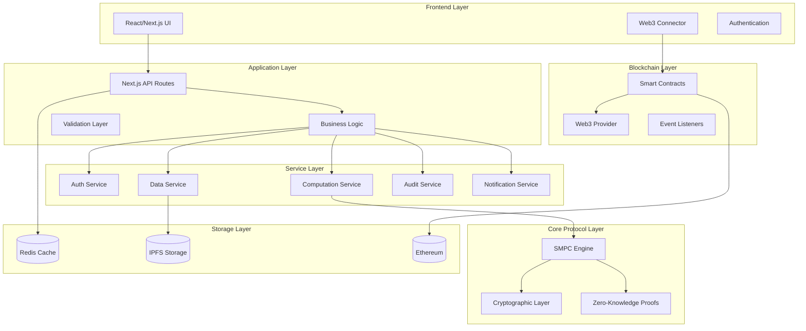

# Technical Specification - SMPC Protocol Demonstration Platform

## Overview
This technical specification document outlines the complete system architecture, implementation details, and technical requirements for the SMPC (Secure Multi-Party Computation) Protocol demonstration platform based on Chapter 4: Solution Plan from the thesis "The Protocol of Privacy Data Trading and Computing with Web3".

## Current Implementation Status (Updated December 2024)
- ✅ **Full Web3 Integration**: MetaMask authentication with smart contracts
- ✅ **User-Defined Algorithm System**: Complete algorithm management and execution
- ✅ **Enhanced Data Consumer Dashboard**: Integrated with personal datasets
- ✅ **Mobile-Responsive Design**: PWA-ready with mobile optimization
- ✅ **Real-time Monitoring**: System health and computation tracking
- ✅ **Sample Data Integration**: Health screening datasets with realistic data

## System Architecture

### 1. High-Level Architecture



### 2. Component Architecture

#### Frontend Architecture
```typescript
interface FrontendArchitecture {
  presentation: {
    pages: NextJSPages;
    components: ReactComponents;
    layouts: ResponsiveLayouts;
  };
  state: {
    global: ZustandStores;
    local: ReactState;
    server: ServerState;
  };
  routing: {
    appRouter: NextJS14Router;
    protection: RouteGuards;
    middleware: AuthMiddleware;
  };
  styling: {
    framework: TailwindCSS;
    components: RadixUI;
    themes: ThemeSystem;
  };
}
```

#### Backend Architecture
```typescript
interface BackendArchitecture {
  api: {
    routes: NextJSAPIRoutes;
    middleware: ExpressMiddleware;
    validation: ZodSchemas;
  };
  services: {
    authentication: NextAuth;
    database: RedisClient;
    blockchain: EthersJS;
    encryption: CustomCrypto;
  };
  protocols: {
    smpc: SMPCEngine;
    zkProofs: ZKProofSystem;
    secretSharing: SecretSharingProtocols;
  };
}
```

## Core Technical Components

### 1. Authentication & Authorization System

#### Multi-Modal Authentication
```typescript
interface AuthenticationSystem {
  web2: {
    oauth: OAuthProviders;
    jwt: JWTTokenSystem;
    session: SessionManagement;
  };
  web3: {
    walletConnect: WalletConnectors;
    signature: MessageSigning;
    verification: SignatureVerification;
  };
  mfa: {
    totp: TOTPGeneration;
    sms: SMSVerification;
    email: EmailVerification;
  };
}

class AuthenticationService {
  async authenticateUser(credentials: AuthCredentials): Promise<AuthResult> {
    switch (credentials.method) {
      case 'oauth':
        return this.handleOAuthAuth(credentials);
      case 'web3':
        return this.handleWeb3Auth(credentials);
      case 'mfa':
        return this.handleMFAAuth(credentials);
      default:
        throw new Error('Unsupported authentication method');
    }
  }

  private async handleWeb3Auth(credentials: Web3Credentials): Promise<AuthResult> {
    // 1. Verify wallet connection
    const wallet = await this.verifyWalletConnection(credentials.walletAddress);
    
    // 2. Generate nonce for signature
    const nonce = this.generateNonce();
    
    // 3. Verify signed message
    const isValidSignature = await this.verifySignature(
      credentials.signature,
      nonce,
      credentials.walletAddress
    );
    
    if (!isValidSignature) {
      throw new AuthenticationError('Invalid signature');
    }
    
    // 4. Create or update user profile
    const user = await this.createOrUpdateWeb3User(credentials.walletAddress);
    
    // 5. Generate session
    const session = await this.createSecureSession(user);
    
    return { success: true, user, session };
  }
}
```

#### Role-Based Access Control
```typescript
interface RoleBasedAccessControl {
  roles: UserRole[];
  permissions: Permission[];
  policies: AccessPolicy[];
}

enum UserRole {
  DATA_PROVIDER = 'data-provider',
  AUDITOR = 'auditor',
  DATA_CONSUMER = 'data-consumer',
  ADMIN = 'admin'
}

interface Permission {
  resource: string;
  action: string;
  conditions?: AccessCondition[];
}

class AccessControlService {
  async checkPermission(
    user: User,
    resource: string,
    action: string
  ): Promise<boolean> {
    const userRoles = await this.getUserRoles(user.id);
    const permissions = await this.getRolePermissions(userRoles);
    
    return permissions.some(permission =>
      permission.resource === resource &&
      permission.action === action &&
      this.evaluateConditions(permission.conditions, user)
    );
  }

  private evaluateConditions(
    conditions: AccessCondition[],
    user: User
  ): boolean {
    return conditions.every(condition =>
      this.evaluateCondition(condition, user)
    );
  }
}
```

### 2. SMPC Protocol Implementation

#### Multi-Key Fully Homomorphic Encryption
```typescript
interface MKFHEImplementation {
  keyGeneration: KeyGenerationAlgorithm;
  encryption: EncryptionAlgorithm;
  operations: HomomorphicOperations;
  decryption: DistributedDecryption;
}

class MKFHEEngine implements MKFHEImplementation {
  private parameters: MKFHEParameters;
  private ntruEngine: NTRUEngine;

  constructor(securityLevel: number = 128) {
    this.parameters = this.generateParameters(securityLevel);
    this.ntruEngine = new NTRUEngine(this.parameters);
  }

  async generateKeyPair(): Promise<KeyPair> {
    // Generate NTRU key pair for post-quantum security
    const ntruKeys = await this.ntruEngine.generateKeys();
    
    // Generate additional parameters for multi-key support
    const mkfheParams = this.generateMKFHEParameters();
    
    return {
      publicKey: {
        ntruPublicKey: ntruKeys.publicKey,
        mkfheParams: mkfheParams.publicParams
      },
      privateKey: {
        ntruPrivateKey: ntruKeys.privateKey,
        mkfheParams: mkfheParams.privateParams
      }
    };
  }

  async encrypt(
    plaintext: Buffer,
    publicKeys: PublicKey[]
  ): Promise<MKFHECiphertext> {
    // Combine public keys for multi-key encryption
    const combinedKey = await this.combinePublicKeys(publicKeys);
    
    // Encrypt using combined key
    const ciphertext = await this.ntruEngine.encrypt(plaintext, combinedKey);
    
    // Add homomorphic encryption layer
    const homomorphicCiphertext = await this.addHomomorphicLayer(ciphertext);
    
    return {
      ciphertext: homomorphicCiphertext,
      publicKeyHashes: publicKeys.map(key => this.hashPublicKey(key)),
      parameters: this.parameters
    };
  }

  async homomorphicAdd(
    c1: MKFHECiphertext,
    c2: MKFHECiphertext
  ): Promise<MKFHECiphertext> {
    // Verify compatibility
    if (!this.areCompatible(c1, c2)) {
      throw new Error('Ciphertexts are not compatible for addition');
    }

    // Perform homomorphic addition
    const resultCiphertext = await this.performHomomorphicAddition(
      c1.ciphertext,
      c2.ciphertext
    );

    return {
      ciphertext: resultCiphertext,
      publicKeyHashes: [...c1.publicKeyHashes, ...c2.publicKeyHashes],
      parameters: this.parameters
    };
  }

  async distributedDecryption(
    ciphertext: MKFHECiphertext,
    privateKeyShares: PrivateKeyShare[]
  ): Promise<Buffer> {
    // Verify threshold
    if (privateKeyShares.length < this.parameters.threshold) {
      throw new Error('Insufficient private key shares for decryption');
    }

    // Generate partial decryptions
    const partialDecryptions = await Promise.all(
      privateKeyShares.map(share =>
        this.generatePartialDecryption(ciphertext, share)
      )
    );

    // Combine partial decryptions
    const plaintext = await this.combinePartialDecryptions(partialDecryptions);

    return plaintext;
  }
}
```

#### Secret Sharing Protocols
```typescript
class SecretSharingProtocols {
  private shamir: ShamirSecretSharing;
  private bgw: BGWProtocol;
  private additive: AdditiveSecretSharing;

  constructor(threshold: number, participants: number) {
    this.shamir = new ShamirSecretSharing(threshold, participants);
    this.bgw = new BGWProtocol(threshold, participants);
    this.additive = new AdditiveSecretSharing(participants);
  }

  async shareSecret(secret: BigInt, protocol: string): Promise<SecretShare[]> {
    switch (protocol) {
      case 'shamir':
        return this.shamir.share(secret);
      case 'additive':
        return this.additive.share(secret);
      default:
        throw new Error(`Unsupported protocol: ${protocol}`);
    }
  }

  async reconstructSecret(shares: SecretShare[], protocol: string): Promise<BigInt> {
    switch (protocol) {
      case 'shamir':
        return this.shamir.reconstruct(shares);
      case 'additive':
        return this.additive.reconstruct(shares);
      default:
        throw new Error(`Unsupported protocol: ${protocol}`);
    }
  }

  async multiplyShares(
    shareA: SecretShare,
    shareB: SecretShare
  ): Promise<SecretShare> {
    // Use BGW protocol for multiplication
    return this.bgw.multiplyShares(shareA, shareB);
  }
}
```

#### Zero-Knowledge Proof System
```typescript
interface ZKProofSystem {
  snarks: ZKSNARKSystem;
  starks: ZKSTARKSystem;
  bulletproofs: BulletproofsSystem;
  plonk: PLONKSystem;
}

class ZeroKnowledgeProofs implements ZKProofSystem {
  snarks: ZKSNARKSystem;
  starks: ZKSTARKSystem;
  bulletproofs: BulletproofsSystem;
  plonk: PLONKSystem;

  async generateComputationProof(
    computation: SMPCComputation
  ): Promise<ComputationProof> {
    // Create arithmetic circuit for the computation
    const circuit = await this.createArithmeticCircuit(computation);
    
    // Generate witness
    const witness = await this.generateWitness(computation, circuit);
    
    // Setup proving and verifying keys
    const { provingKey, verifyingKey } = await this.snarks.setup(circuit);
    
    // Generate proof
    const proof = await this.snarks.prove(witness, provingKey);
    
    return {
      proof: proof,
      verifyingKey: verifyingKey,
      publicInputs: computation.publicInputs,
      circuitHash: await this.hashCircuit(circuit)
    };
  }

  async verifyComputationProof(
    proof: ComputationProof,
    expectedResult: any
  ): Promise<boolean> {
    // Verify the zk-SNARK proof
    const isValidProof = await this.snarks.verify(
      proof.proof,
      proof.publicInputs,
      proof.verifyingKey
    );

    if (!isValidProof) return false;

    // Additional verification of computation result
    const isValidResult = await this.verifyComputationResult(
      expectedResult,
      proof.publicInputs
    );

    return isValidResult;
  }

  async generatePrivacyComplianceProof(
    data: EncryptedData,
    processing: ProcessingLog
  ): Promise<ComplianceProof> {
    // Create compliance circuit (GDPR, CCPA, etc.)
    const complianceCircuit = await this.createComplianceCircuit(processing);
    
    // Generate witness for compliance
    const witness = await this.generateComplianceWitness(data, processing);
    
    // Use PLONK for universal setup
    const proof = await this.plonk.prove(witness, complianceCircuit);
    
    return {
      proof: proof,
      complianceStandards: processing.complianceStandards,
      dataCategories: data.categories,
      timestamp: Date.now()
    };
  }
}
```

### 3. Smart Contract System

#### Core Smart Contracts Architecture
```solidity
// DataRegistry.sol
pragma solidity ^0.8.19;

import "@openzeppelin/contracts/security/ReentrancyGuard.sol";
import "@openzeppelin/contracts/access/AccessControl.sol";
import "@openzeppelin/contracts/security/Pausable.sol";

contract DataRegistry is ReentrancyGuard, AccessControl, Pausable {
    bytes32 public constant AUDITOR_ROLE = keccak256("AUDITOR_ROLE");
    bytes32 public constant DATA_PROVIDER_ROLE = keccak256("DATA_PROVIDER_ROLE");
    
    struct DataEntry {
        bytes32 dataHash;
        address provider;
        string metadataURI;
        uint256 price;
        bool isActive;
        uint256 timestamp;
        string[] complianceStandards;
        bytes32 encryptionKeyHash;
        DataCategory category;
    }
    
    enum DataCategory {
        HEALTHCARE,
        FINANCIAL,
        PERSONAL,
        SCIENTIFIC,
        COMMERCIAL
    }
    
    mapping(bytes32 => DataEntry) public dataEntries;
    mapping(address => bytes32[]) public providerData;
    mapping(DataCategory => bytes32[]) public categoryData;
    
    event DataRegistered(
        bytes32 indexed dataHash,
        address indexed provider,
        DataCategory category,
        uint256 price
    );
    
    event DataUpdated(
        bytes32 indexed dataHash,
        uint256 newPrice,
        bool isActive
    );
    
    event ComplianceVerified(
        bytes32 indexed dataHash,
        address indexed auditor,
        string[] standards
    );
    
    modifier onlyDataProvider() {
        require(
            hasRole(DATA_PROVIDER_ROLE, msg.sender),
            "DataRegistry: caller is not a data provider"
        );
        _;
    }
    
    modifier onlyAuditor() {
        require(
            hasRole(AUDITOR_ROLE, msg.sender),
            "DataRegistry: caller is not an auditor"
        );
        _;
    }
    
    function registerData(
        bytes32 _dataHash,
        string memory _metadataURI,
        uint256 _price,
        DataCategory _category,
        string[] memory _complianceStandards,
        bytes32 _encryptionKeyHash
    ) external onlyDataProvider nonReentrant whenNotPaused {
        require(_dataHash != bytes32(0), "DataRegistry: invalid data hash");
        require(dataEntries[_dataHash].provider == address(0), "DataRegistry: data already registered");
        require(_price > 0, "DataRegistry: price must be greater than 0");
        
        dataEntries[_dataHash] = DataEntry({
            dataHash: _dataHash,
            provider: msg.sender,
            metadataURI: _metadataURI,
            price: _price,
            isActive: false, // Requires auditor approval
            timestamp: block.timestamp,
            complianceStandards: _complianceStandards,
            encryptionKeyHash: _encryptionKeyHash,
            category: _category
        });
        
        providerData[msg.sender].push(_dataHash);
        categoryData[_category].push(_dataHash);
        
        emit DataRegistered(_dataHash, msg.sender, _category, _price);
    }
    
    function approveData(
        bytes32 _dataHash,
        string[] memory _verifiedStandards
    ) external onlyAuditor nonReentrant {
        require(dataEntries[_dataHash].provider != address(0), "DataRegistry: data not found");
        require(!dataEntries[_dataHash].isActive, "DataRegistry: data already approved");
        
        dataEntries[_dataHash].isActive = true;
        dataEntries[_dataHash].complianceStandards = _verifiedStandards;
        
        emit ComplianceVerified(_dataHash, msg.sender, _verifiedStandards);
    }
    
    function updateDataPrice(
        bytes32 _dataHash,
        uint256 _newPrice
    ) external onlyDataProvider nonReentrant {
        require(dataEntries[_dataHash].provider == msg.sender, "DataRegistry: not data owner");
        require(_newPrice > 0, "DataRegistry: price must be greater than 0");
        
        dataEntries[_dataHash].price = _newPrice;
        
        emit DataUpdated(_dataHash, _newPrice, dataEntries[_dataHash].isActive);
    }
    
    function getDatasByCategory(DataCategory _category) external view returns (bytes32[] memory) {
        return categoryData[_category];
    }
    
    function getProviderData(address _provider) external view returns (bytes32[] memory) {
        return providerData[_provider];
    }
}
```

#### Computing Request Contract
```solidity
// ComputingRequest.sol
pragma solidity ^0.8.19;

import "./DataRegistry.sol";
import "./FeeManagement.sol";
import "@openzeppelin/contracts/security/ReentrancyGuard.sol";

contract ComputingRequest is ReentrancyGuard {
    DataRegistry public dataRegistry;
    FeeManagement public feeManagement;
    
    enum RequestStatus {
        PENDING,
        APPROVED,
        COMPUTING,
        COMPLETED,
        FAILED,
        CANCELLED
    }
    
    struct Request {
        bytes32 requestId;
        address consumer;
        bytes32[] dataHashes;
        uint256 totalFee;
        RequestStatus status;
        string computingScript;
        bytes32 resultHash;
        uint256 timestamp;
        address[] requiredApprovers;
        mapping(address => bool) approvals;
        uint256 approvalCount;
    }
    
    mapping(bytes32 => Request) public requests;
    mapping(address => bytes32[]) public consumerRequests;
    mapping(bytes32 => bool) public completedComputations;
    
    event RequestSubmitted(
        bytes32 indexed requestId,
        address indexed consumer,
        bytes32[] dataHashes,
        uint256 totalFee
    );
    
    event RequestApproved(
        bytes32 indexed requestId,
        address indexed approver
    );
    
    event ComputationCompleted(
        bytes32 indexed requestId,
        bytes32 resultHash,
        uint256 completionTime
    );
    
    event RequestCancelled(
        bytes32 indexed requestId,
        string reason
    );
    
    modifier onlyConsumer(bytes32 _requestId) {
        require(requests[_requestId].consumer == msg.sender, "ComputingRequest: not request owner");
        _;
    }
    
    modifier onlyApprover(bytes32 _requestId) {
        bool isApprover = false;
        for (uint i = 0; i < requests[_requestId].requiredApprovers.length; i++) {
            if (requests[_requestId].requiredApprovers[i] == msg.sender) {
                isApprover = true;
                break;
            }
        }
        require(isApprover, "ComputingRequest: not authorized approver");
        _;
    }
    
    function submitComputingRequest(
        bytes32[] memory _dataHashes,
        string memory _computingScript,
        address[] memory _requiredApprovers
    ) external payable nonReentrant {
        require(_dataHashes.length > 0, "ComputingRequest: no data specified");
        require(_requiredApprovers.length > 0, "ComputingRequest: no approvers specified");
        
        // Calculate total fees
        uint256 totalFee = feeManagement.calculateTotalFee(_dataHashes);
        require(msg.value >= totalFee, "ComputingRequest: insufficient payment");
        
        // Verify all data is approved and active
        for (uint i = 0; i < _dataHashes.length; i++) {
            (,, , , bool isActive,,,,) = dataRegistry.dataEntries(_dataHashes[i]);
            require(isActive, "ComputingRequest: data not approved or inactive");
        }
        
        bytes32 requestId = keccak256(abi.encodePacked(
            msg.sender,
            _dataHashes,
            _computingScript,
            block.timestamp
        ));
        
        Request storage request = requests[requestId];
        request.requestId = requestId;
        request.consumer = msg.sender;
        request.dataHashes = _dataHashes;
        request.totalFee = totalFee;
        request.status = RequestStatus.PENDING;
        request.computingScript = _computingScript;
        request.timestamp = block.timestamp;
        request.requiredApprovers = _requiredApprovers;
        request.approvalCount = 0;
        
        consumerRequests[msg.sender].push(requestId);
        
        // Escrow payment
        feeManagement.escrowPayment{value: msg.value}(requestId, msg.sender);
        
        emit RequestSubmitted(requestId, msg.sender, _dataHashes, totalFee);
    }
    
    function approveRequest(bytes32 _requestId) external onlyApprover(_requestId) {
        Request storage request = requests[_requestId];
        require(request.status == RequestStatus.PENDING, "ComputingRequest: invalid status");
        require(!request.approvals[msg.sender], "ComputingRequest: already approved");
        
        request.approvals[msg.sender] = true;
        request.approvalCount++;
        
        emit RequestApproved(_requestId, msg.sender);
        
        // Check if all approvals received
        if (request.approvalCount >= request.requiredApprovers.length) {
            request.status = RequestStatus.APPROVED;
        }
    }
    
    function completeComputation(
        bytes32 _requestId,
        bytes32 _resultHash
    ) external nonReentrant {
        // This would be called by the SMPC computation nodes
        Request storage request = requests[_requestId];
        require(request.status == RequestStatus.APPROVED, "ComputingRequest: not approved");
        
        request.status = RequestStatus.COMPLETED;
        request.resultHash = _resultHash;
        completedComputations[_requestId] = true;
        
        // Distribute fees to data providers and platform
        feeManagement.distributeFees(_requestId, request.dataHashes);
        
        emit ComputationCompleted(_requestId, _resultHash, block.timestamp);
    }
}
```

### 4. Database Schema & Redis Integration

#### Redis Data Structures
```typescript
interface RedisSchemas {
  sessions: UserSession;
  cache: CacheStructure;
  realtime: RealtimeData;
  temporary: TemporaryData;
}

interface UserSession {
  key: string; // "session:{sessionId}"
  value: {
    userId: string;
    role: UserRole;
    authMethod: AuthMethod;
    walletAddress?: string;
    permissions: Permission[];
    createdAt: Date;
    expiresAt: Date;
    lastActive: Date;
  };
  ttl: number; // 7 days
}

interface CacheStructure {
  userProfiles: {
    key: string; // "user:{userId}"
    value: UserProfile;
    ttl: number; // 24 hours
  };
  dataMetadata: {
    key: string; // "data:{dataHash}"
    value: DataMetadata;
    ttl: number; // 12 hours
  };
  computationResults: {
    key: string; // "result:{requestId}"
    value: ComputationResult;
    ttl: number; // 30 days
  };
  auditReports: {
    key: string; // "audit:{auditId}"
    value: AuditReport;
    ttl: number; // 90 days
  };
}

class RedisService {
  private client: RedisClient;

  constructor(redisUrl: string) {
    this.client = new Redis(redisUrl);
  }

  // Session Management
  async createSession(session: UserSession): Promise<void> {
    const key = `session:${session.sessionId}`;
    await this.client.setex(key, 7 * 24 * 60 * 60, JSON.stringify(session));
  }

  async getSession(sessionId: string): Promise<UserSession | null> {
    const key = `session:${sessionId}`;
    const data = await this.client.get(key);
    return data ? JSON.parse(data) : null;
  }

  async updateSessionActivity(sessionId: string): Promise<void> {
    const key = `session:${sessionId}`;
    const session = await this.getSession(sessionId);
    if (session) {
      session.lastActive = new Date();
      await this.client.setex(key, 7 * 24 * 60 * 60, JSON.stringify(session));
    }
  }

  // Cache Management
  async cacheUserProfile(userId: string, profile: UserProfile): Promise<void> {
    const key = `user:${userId}`;
    await this.client.setex(key, 24 * 60 * 60, JSON.stringify(profile));
  }

  async getCachedUserProfile(userId: string): Promise<UserProfile | null> {
    const key = `user:${userId}`;
    const data = await this.client.get(key);
    return data ? JSON.parse(data) : null;
  }

  // Real-time Data
  async publishComputationUpdate(requestId: string, update: ComputationUpdate): Promise<void> {
    const channel = `computation:${requestId}`;
    await this.client.publish(channel, JSON.stringify(update));
  }

  async subscribeToComputationUpdates(
    requestId: string,
    callback: (update: ComputationUpdate) => void
  ): Promise<void> {
    const channel = `computation:${requestId}`;
    await this.client.subscribe(channel);
    this.client.on('message', (receivedChannel, message) => {
      if (receivedChannel === channel) {
        const update = JSON.parse(message);
        callback(update);
      }
    });
  }

  // Temporary Data Storage
  async storeTemporaryEncryptedData(
    dataId: string,
    encryptedData: Buffer,
    ttl: number = 3600 // 1 hour
  ): Promise<void> {
    const key = `temp:${dataId}`;
    await this.client.setex(key, ttl, encryptedData);
  }

  async getTemporaryEncryptedData(dataId: string): Promise<Buffer | null> {
    const key = `temp:${dataId}`;
    const data = await this.client.getBuffer(key);
    return data;
  }
}
```

### 5. API Specification

#### RESTful API Design
```typescript
interface APIEndpoints {
  // Authentication
  'POST /api/auth/login': {
    body: LoginCredentials;
    response: AuthResponse;
  };
  'POST /api/auth/web3': {
    body: Web3AuthCredentials;
    response: AuthResponse;
  };
  'POST /api/auth/logout': {
    response: { success: boolean };
  };

  // Data Management
  'POST /api/data/upload': {
    body: FormData;
    response: DataUploadResponse;
  };
  'POST /api/data/register': {
    body: DataRegistrationRequest;
    response: RegistrationResponse;
  };
  'GET /api/data/search': {
    query: DataSearchQuery;
    response: DataSearchResponse;
  };
  'GET /api/data/:id': {
    params: { id: string };
    response: DataDetails;
  };

  // SMPC Computation
  'POST /api/computation/request': {
    body: ComputationRequest;
    response: ComputationResponse;
  };
  'GET /api/computation/:id/status': {
    params: { id: string };
    response: ComputationStatus;
  };
  'GET /api/computation/:id/result': {
    params: { id: string };
    response: ComputationResult;
  };

  // Audit Operations
  'POST /api/audit/submit': {
    body: AuditSubmission;
    response: AuditResponse;
  };
  'POST /api/audit/:id/approve': {
    params: { id: string };
    body: ApprovalDecision;
    response: ApprovalResponse;
  };
  'GET /api/audit/reports': {
    query: AuditQuery;
    response: AuditReports;
  };

  // Blockchain Integration
  'POST /api/blockchain/transaction': {
    body: TransactionRequest;
    response: TransactionResponse;
  };
  'GET /api/blockchain/events': {
    query: EventQuery;
    response: BlockchainEvents;
  };
}
```

#### WebSocket Events
```typescript
interface WebSocketEvents {
  // Real-time computation updates
  'computation:status': ComputationStatusUpdate;
  'computation:progress': ComputationProgressUpdate;
  'computation:completed': ComputationCompletedEvent;
  'computation:error': ComputationErrorEvent;

  // Blockchain events
  'blockchain:transaction': TransactionEvent;
  'blockchain:confirmation': ConfirmationEvent;
  'blockchain:contract-event': ContractEvent;

  // Audit events
  'audit:request': AuditRequestEvent;
  'audit:approved': AuditApprovedEvent;
  'audit:rejected': AuditRejectedEvent;

  // System events
  'system:notification': SystemNotification;
  'system:maintenance': MaintenanceEvent;
}
```

### 6. Security Specifications

#### Security Framework
```typescript
interface SecuritySpecification {
  encryption: EncryptionSpec;
  authentication: AuthenticationSpec;
  authorization: AuthorizationSpec;
  dataProtection: DataProtectionSpec;
  networkSecurity: NetworkSecuritySpec;
  auditLogging: AuditLoggingSpec;
}

interface EncryptionSpec {
  algorithms: {
    symmetric: 'AES-256-GCM';
    asymmetric: 'NTRU' | 'RSA-4096';
    homomorphic: 'MKFHE-NTRU';
    hashing: 'SHA-256' | 'Blake3';
  };
  keyManagement: {
    generation: 'Hardware-based' | 'Cryptographically-secure-random';
    storage: 'Encrypted-at-rest';
    rotation: 'Automatic-90-days';
    escrow: 'Multi-party-threshold';
  };
  protocols: {
    tls: 'TLS-1.3';
    websocket: 'WSS-with-TLS-1.3';
    api: 'HTTPS-only';
  };
}

interface DataProtectionSpec {
  classification: DataClassification;
  minimization: DataMinimizationPolicies;
  retention: DataRetentionPolicies;
  anonymization: AnonymizationTechniques;
  compliance: ComplianceFramework;
}

interface ComplianceFramework {
  gdpr: GDPRCompliance;
  ccpa: CCPACompliance;
  hipaa: HIPAACompliance;
  sox: SOXCompliance;
}
```

#### Threat Model & Mitigation
```typescript
interface ThreatModel {
  threats: SecurityThreat[];
  mitigations: SecurityMitigation[];
  riskAssessment: RiskAssessment;
}

interface SecurityThreat {
  id: string;
  name: string;
  description: string;
  category: ThreatCategory;
  severity: 'LOW' | 'MEDIUM' | 'HIGH' | 'CRITICAL';
  likelihood: 'RARE' | 'UNLIKELY' | 'POSSIBLE' | 'LIKELY' | 'CERTAIN';
  impact: 'MINIMAL' | 'MINOR' | 'MODERATE' | 'MAJOR' | 'CATASTROPHIC';
  assets: AssetType[];
}

enum ThreatCategory {
  AUTHENTICATION_BYPASS = 'authentication-bypass',
  AUTHORIZATION_ESCALATION = 'authorization-escalation',
  DATA_EXPOSURE = 'data-exposure',
  CRYPTOGRAPHIC_ATTACK = 'cryptographic-attack',
  SMART_CONTRACT_VULNERABILITY = 'smart-contract-vulnerability',
  SIDE_CHANNEL_ATTACK = 'side-channel-attack',
  DENIAL_OF_SERVICE = 'denial-of-service'
}
```

## Performance Requirements

### 1. Performance Benchmarks
```typescript
interface PerformanceRequirements {
  frontend: {
    initialLoad: '< 2 seconds';
    routeTransition: '< 300ms';
    apiResponse: '< 500ms';
    realTimeUpdates: '< 100ms latency';
  };
  backend: {
    apiResponseTime: '< 200ms average';
    databaseQuery: '< 50ms average';
    cacheHit: '< 10ms';
    blockchainTx: '< 30 seconds';
  };
  smpc: {
    encryption: '< 5 seconds for 100MB';
    decryption: '< 10 seconds for distributed';
    computation: '< 60 seconds for basic operations';
    proofGeneration: '< 30 seconds';
    proofVerification: '< 5 seconds';
  };
  scalability: {
    concurrentUsers: 1000;
    concurrentComputations: 50;
    datasetSize: '10GB maximum';
    throughput: '100 requests/second';
  };
}
```

### 2. Monitoring & Observability
```typescript
interface MonitoringSpec {
  metrics: SystemMetrics;
  logging: LoggingConfiguration;
  alerting: AlertingRules;
  dashboards: MonitoringDashboards;
}

interface SystemMetrics {
  application: {
    requestRate: 'requests/second';
    responseTime: 'milliseconds';
    errorRate: 'percentage';
    uptime: 'percentage';
  };
  smpc: {
    computationLatency: 'seconds';
    encryptionThroughput: 'MB/second';
    proofGenerationTime: 'seconds';
    participantCount: 'number';
  };
  blockchain: {
    transactionLatency: 'seconds';
    gasUsage: 'wei';
    blockConfirmations: 'number';
    eventProcessingDelay: 'milliseconds';
  };
  infrastructure: {
    cpuUsage: 'percentage';
    memoryUsage: 'percentage';
    diskUsage: 'percentage';
    networkLatency: 'milliseconds';
  };
}
```

## Deployment Architecture

### 1. Infrastructure Requirements
```yaml
# Production Infrastructure
Production:
  Frontend:
    - Next.js Application (3 replicas)
    - CDN (CloudFlare/AWS CloudFront)
    - Load Balancer (NGINX/AWS ALB)
  
  Backend:
    - API Servers (3 replicas)
    - Redis Cluster (3 nodes)
    - SMPC Computation Nodes (5 nodes)
  
  Blockchain:
    - Ethereum Node (Mainnet/Testnet)
    - IPFS Node
    - Event Processing Service
  
  Monitoring:
    - Prometheus + Grafana
    - ELK Stack
    - Sentry (Error Tracking)
    - Custom Metrics Dashboard

Staging:
  - Single replica of all services
  - Reduced resource allocation
  - Test blockchain network

Development:
  - Docker Compose setup
  - Local blockchain (Ganache)
  - Local IPFS node
```

### 2. CI/CD Pipeline
```yaml
# GitHub Actions Workflow
Pipeline:
  Stages:
    - Code Quality Check
    - Security Scan
    - Unit Tests
    - Integration Tests
    - Smart Contract Tests
    - Build & Package
    - Security Audit
    - Deploy to Staging
    - E2E Tests
    - Performance Tests
    - Deploy to Production
    - Smoke Tests
    - Monitor Deployment

  Security:
    - Dependency Scanning
    - Static Code Analysis
    - Container Security Scan
    - Smart Contract Audit
    - Infrastructure Security Check
```

## Conclusion

This technical specification provides a comprehensive blueprint for implementing the SMPC Protocol demonstration platform. The architecture follows modern software engineering practices while implementing cutting-edge cryptographic protocols for privacy-preserving computation.

Key architectural decisions:
- **Modular Design**: Separation of concerns across layers
- **Security First**: Defense in depth approach
- **Scalability**: Designed for horizontal scaling
- **Compliance**: Built-in regulatory compliance features
- **Observability**: Comprehensive monitoring and logging
- **Developer Experience**: Clear APIs and documentation

The system is designed to demonstrate the practical implementation of the theoretical framework outlined in Chapter 4 of the thesis while maintaining production-quality standards for security, performance, and reliability.